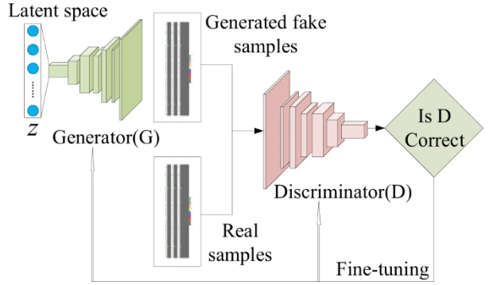
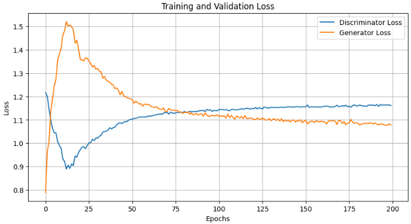
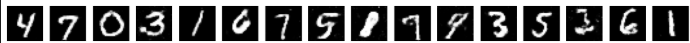

# Generative Adversarial Network (GAN) for MNIST

This repository contains a simple Generative Adversarial Network (GAN) implemented in PyTorch to generate handwritten digits from the MNIST dataset.

## Generative Adversarial Network (GAN)



_Figure 1. Architecture of GAN [1]_

A GAN consists of two neural networks, a Generator and a Discriminator, that are trained simultaneously in a zero-sum game.

### Key Concepts:

-   **Generator:** Takes a random noise vector as input and attempts to generate a realistic image (in this case, a handwritten digit). Its goal is to produce images that can fool the Discriminator.
-   **Discriminator:** Takes both real images from the dataset and fake images from the Generator as input. Its goal is to distinguish between the real and fake images.
-   **Adversarial Training:** The Generator and Discriminator are trained in opposition. The Generator gets better at creating convincing images, while the Discriminator gets better at detecting them. This process drives the Generator to produce increasingly realistic images.

## Requirements

This project uses [Poetry](https://python-poetry.org/) for dependency management. The main dependencies are:

-   `torch`
-   `torchvision`
-   `matplotlib`
-   `tqdm`

## Usage

1.  **Clone the repository:**
    ```bash
    git clone https://github.com/your-username/GAN-MNIST.git
    cd GAN-MNIST
    ```
2.  **Install dependencies:**
    ```bash
    poetry install
    ```
3.  **Run the Jupyter notebook**
    The `GAN.ipynb` notebook contains the complete code for building, training, and visualizing the GAN.

## Result

### Training

The training process is documented in the `GAN.ipynb` notebook. It involves:

-   Loading the MNIST training data.
-   Defining the Generator and Discriminator networks.
-   Training the models adversarially.
-   Visualizing the generated images at the end of training.



_Figure 2. Learning curve of GAN model_

### Generated Images



_Figure 3. Images generated by the trained generator_

## References
1. Dan, Yabo, et al. "Generative adversarial networks (GAN) based efficient sampling of chemical composition space for inverse design of inorganic materials." _npj Computational Materials 6.1 (2020): 84._
2. Goodfellow, Ian J., et al. "Generative adversarial nets." _Advances in neural information processing systems 27 (2014)._